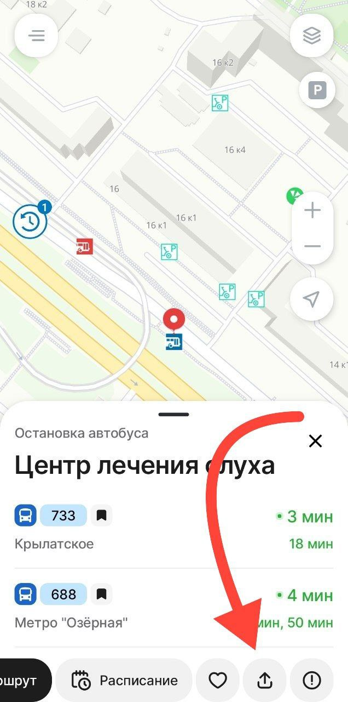

# Moscow Transport для Home Assistant

[](https://github.com/custom-components/hacs)


Компонент для получения времени прибытия следующего автобуса к остановке в Москве из приложения Транспорт Москвы

## Для получения UUID остановки


- Нужно в приложении Московский транспорт https://play.google.com/store/apps/details?id=ru.mosgorpass выбрать на карте интересующую остановку
- Нажать на кнопку поделиться
- Получившися адрес вида https://moscowapp.mos.ru/l/S0G3Qb необходимо открыть в браузере
- В адресной строке браузера он изменится на адрес вида https://moscowapp.mos.ru/stop?id=99a2734d-84ed-4361-8cc2-5cb3e4e778c5
- id остановки в адресе 99a2734d-84ed-4361-8cc2-5cb3e4e778c5 нужно использовать в конфигурации

## Для показа ближайших рейсов
Для активации необходимо в `configuration.yaml`
```yaml
# Пример configuration.yaml
sensor:
  - platform: moscow_transport
    stop_id: YOUR_STOP_ID
```

## Пример полной конфигурации
```yaml
# Пример configuration.yaml
sensor:
  - platform: moscow_transport
    name: От метро
    stop_id: a6477b89-72c7-4359-8286-3f148874d653
    routes:
      - 733
      - 733к
      - 688
  - platform: moscow_transport
    name: К метро
    stop_id: 99a2734d-84ed-4361-8cc2-5cb3e4e778c5
  - platform: moscow_transport
    name: К метро Крылатское
    stop_id: 2b348a58-a3e4-4937-b973-18cfe0f87e5e
```

## Для локальной разработки
- ```docker-compose up```
- http://localhost:8123/

# Для тестирования
```bash
pip install pytest-watch
ptw
```

## Примеры ссылок из приложения
https://moscowapp.mos.ru/stop?id=a6477b89-72c7-4359-8286-3f148874d653
https://moscowtransport.app/bus-stop?id=70278228&coordinate=37,55
https://moscowtransport.app/api/stop_v2/a6477b89-72c7-4359-8286-3f148874d653
https://forecast-rate.moscowtransport.app/api/stop_v2/383de055-48af-418a-aa41-aa2746fb9018
